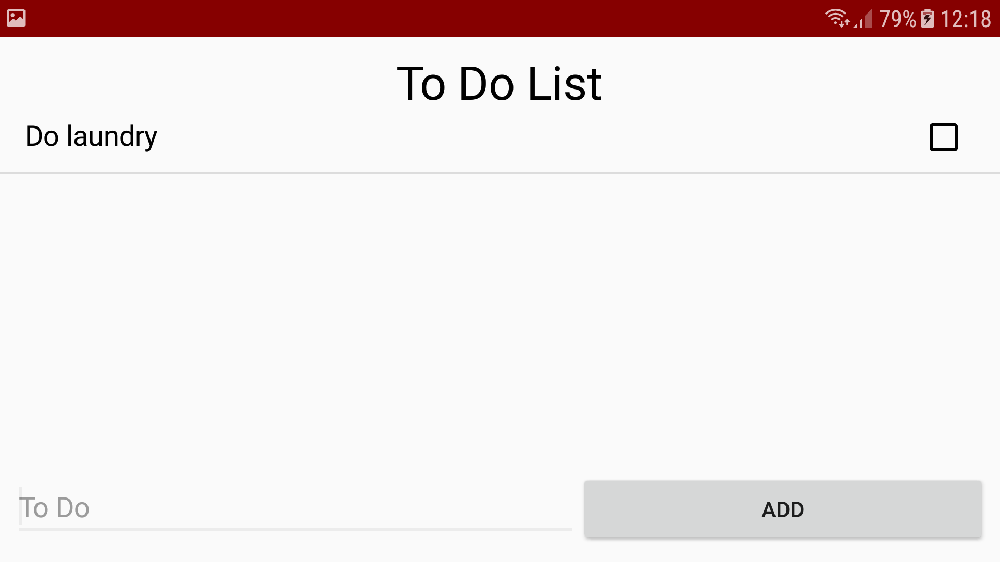

### susannebinkhorstpset4
This app is a simple to-do list app that has a list of tasks that the user needs to complete. Initially the app 
contains three sample to-do items that explain how the app works. If the user types text into a bottom input field and clicks 
an Add button, the new item will be added to the top or bottom of the list. Of course, users must be able to mark items as “done”, 
and delete them as well!

